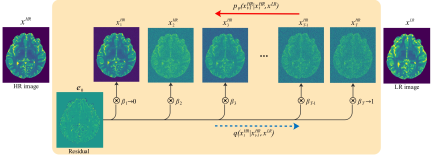

# <p align=center>`MRI super-resolution reconstruction using efficient diffusion probabilistic model with residual shifting`</p> # 


[](https://opensource.org/licenses/MIT)    


:fire::fire:**Res-SRDiff** is a deep learning framework designed to robustly restore high-resolution pelvic T2w MRI and ultra-high field brain T1 maps using an efficient probabilistic diffusion model.

- Our paper on arXiv: [MRI super-resolution reconstruction using efficient diffusion probabilistic model with residual shifting](https://arxiv.org/abs/2503.01576) :heart:


## 🔍 Diffusion Process

The following diagram illustrates the diffusion process used in this project:


<p align="center">  </p>


## Getting Started

**⚠️ *Important:* The code for this study will be released publicly <span style="color:red;">  upon acceptance </span>of the manuscript .**
### Prerequisites

- Python (>=3.12)
- PyTorch (>=2.5)
- NVIDIA CUDA (for GPU acceleration)
- Additional dependencies as listed in `requirements.txt`

### Installation

1. **Clone the repository:**

   ```bash
   git clone https://github.com/mosaf/Res-SRDiff.git
   cd Res-SRDiff

2. **Install dependencies:**

    ```bash
    conda env update --file environment.yml --prune

## Running the Code

To run the project, modify the parameters in the `main.py` file and execute the `main.py` script:

```bash
python main.py
```

## ⚙️ Model Hyper-parameters


The diagram below visualizes the key hyper-parameters used in this model:
<p align="center">  </p>


## 📚 Citation

[//]: # (      author={Mojtaba Safari and Shansong Wang and Zach Eidex and Richard Qiu and Chih-Wei Chang and David S. Yu and Xiaofeng Yang},)

If you find **Res-SRDiff** useful for your research or project, please consider citing our work:

```
@misc{safari2025mrisuperresolutionreconstructionusing,
      title={MRI super-resolution reconstruction using efficient diffusion probabilistic model with residual shifting}, 
      author={Mojtaba Safari and Shansong Wang and Zach Eidex and Qiang Li and Erik H. Middlebrooks and David S. Yu and Xiaofeng Yang},
      year={2025},
      eprint={2503.01576},
      archivePrefix={arXiv},
      primaryClass={cs.CV},
      url={https://arxiv.org/abs/2503.01576}, 
}
```


## Acknowledgments

- This project is based on [Original Repository Name](https://github.com/).
